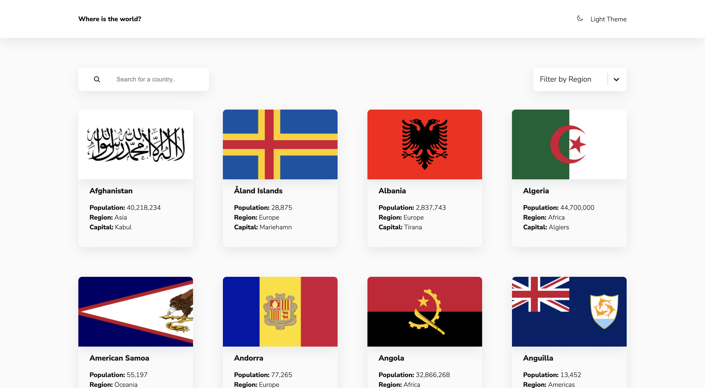
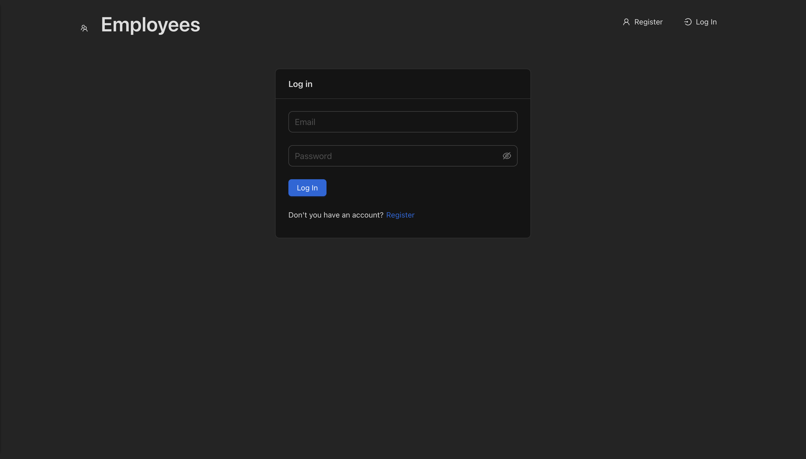

# React

*This is a repository with all my tutorials on react*

---

## *Job listings with filtering*

### /redux/job_listings_with_filtering

> This is not a big project that uses react
> together with the Redux library. The project
> implements card filtering through Redux and
> this is the main goal of the project, to learn
> how Redux works and use it as a storage of
> some logic and data.

*Libraries that are used in the project:*

```
"dependencies": {
    "react": "17.0.2",
    "react-dom": "17.0.2",
    "react-redux": "7.2.6",
    "react-scripts": "5.0.0",
    "redux": "4.1.2"
  }
```

<a href="https://www.youtube.com/watch?v=9VIPbm9x5go&list=PLH3NFo4HRZaXF0nj_INkmNqfBapZ4sxZB">
    
</a>

---

## *Marvel Api*

### /marvel-api

> React application in which the main goal was
> to learn how to work with the API fetch in a
> React application. Practice the Styled Component
> approach. Experiment with developing an
> application without a state manager.

*Libraries that are used in the project:*

```
"dependencies": {
    "@testing-library/react": "11.1.0",
    "@testing-library/user-event": "12.1.10",
    "ldloader": "2.0.1",
    "react": "17.0.2",
    "react-dom": "17.0.2",
    "react-scripts": "4.0.3",
    "styled-components": "5.3.1",
    "web-vitals": "1.0.1"
  }
```

<a href="https://youtu.be/VM3WE4hsw0U">
    
</a>

---

## *Countries*

### /redux/countries

> React application using Redux in its classic
> form using middleware as redux-thunk.
> Detailed to-do list for implementing the
> application:
>
> 1. Switching between light and dark themes
> 2. Retrieving a list of countries and displaying the UI
> 3. Filtering countries by search
> 4. Filtering countries by region
> 5. Get extended information about the selected country
> 6. Getting a list of neighboring countries

*Libraries that are used in the project:*

```
"dependencies": {
    "axios": "0.22.0",
    "lodash.throttle": "4.1.1",
    "react": "17.0.2",
    "react-dom": "17.0.2",
    "react-icons": "4.3.1",
    "react-redux": "7.2.6",
    "react-router-dom": "6.2.1",
    "react-scripts": "5.0.0",
    "react-select": "5.1.0",
    "redux": "4.1.2",
    "redux-thunk": "2.4.1",
    "styled-components": "5.3.1"
  }
```

<a href="https://youtu.be/_bPkDhEaX7Y">
    
</a>

---

---

# *Employees*

### /employees

> A full-fledged React application written
> in NodeJS API. With full-featured authorization
> and employee accounting. Creating, deleting,
> modifying and updating up-to-date information
> about employees. Redux Toolkit is used.
>
> 1. Authorization
> 2. Creating employees
> 3. Deleting employees
> 4. Changing information about employees
> 5. Partitioning into groups of employees

## *Useful commands:*

*- Open Prisma studio with all data*

```
npx prisma studio 
```

## *Libraries that are used in the project:*

***API***

```
"dependencies": {
    "@prisma/client": "^4.13.0",
    "bcrypt": "^5.1.0",
    "concurrently": "^8.0.1",
    "cookie-parser": "~1.4.4",
    "cors": "^2.8.5",
    "debug": "~2.6.9",
    "dotenv": "^16.0.3",
    "express": "~4.16.1",
    "jsonwebtoken": "^9.0.0",
    "morgan": "~1.9.1",
    "vary": "^1.1.2"
  },
```

Client

```
"dependencies": {
    "@ant-design/icons": "^5.0.1",
    "@reduxjs/toolkit": "^1.9.5",
    "antd": "5.1.5",
    "axios": "^1.3.5",
    "eslint-config-airbnb-typescript": "^17.0.0",
    "localforage": "^1.10.0",
    "match-sorter": "^6.3.1",
    "react": "^18.2.0",
    "react-dom": "^18.2.0",
    "react-hook-form": "^7.43.9",
    "react-redux": "^8.0.5",
    "react-router-dom": "^6.8.1",
    "sort-by": "^0.0.2",
    "ts-node": "^10.9.1"
  },
  "devDependencies": {
    "@testing-library/jest-dom": "^5.16.5",
    "@testing-library/react": "^13.4.0",
    "@types/node": "^18.13.0",
    "@types/react": "^18.0.27",
    "@types/react-dom": "^18.0.10",
    "@typescript-eslint/eslint-plugin": "^5.52.0",
    "@typescript-eslint/parser": "^5.52.0",
    "@vitejs/plugin-react-swc": "^3.0.0",
    "eslint": "^8.34.0",
    "eslint-config-airbnb": "^19.0.4",
    "eslint-config-prettier": "^8.6.0",
    "eslint-plugin-import": "^2.27.5",
    "eslint-plugin-jsx-a11y": "^6.7.1",
    "eslint-plugin-prettier": "^4.2.1",
    "eslint-plugin-react": "^7.32.2",
    "eslint-plugin-react-hooks": "^4.6.0",
    "jsdom": "^21.1.0",
    "prettier": "^2.8.4",
    "typescript": "^4.9.3",
    "vite": "^4.1.0",
    "vitest": "^0.28.5"
  }
```

<a href="https://youtu.be/ippnwxnEwjc">
    
</a>

---

# Info:

```
lsof -i :8000
kill [PID]

```

- View the process on port 8000*
- release the process