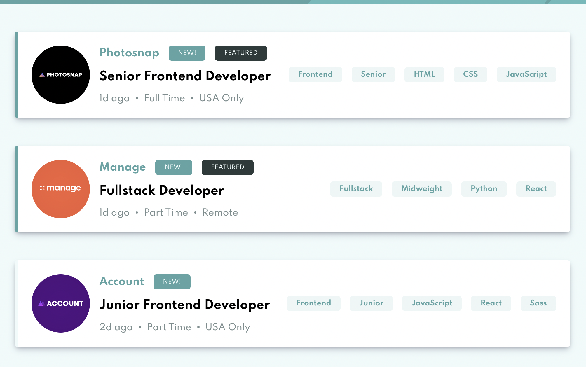
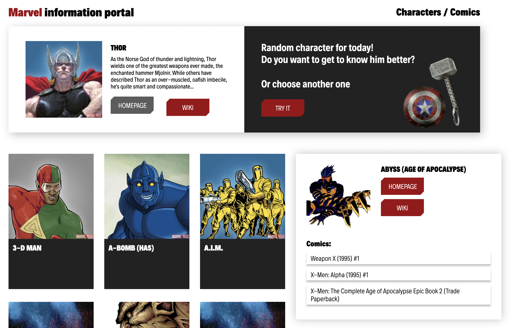

# React

*This is a repository with all my tutorials on react*

-------------------

## *Redux folder*

### Job listings with filtering

> This is not a big project that uses react 
> together with the Redux library. The project 
> implements card filtering through Redux and 
> this is the main goal of the project, to learn 
> how Redux works and use it as a storage of 
> some logic and data.

*Libraries that are used in the project:*
```
"dependencies": {
    "react": "17.0.2",
    "react-dom": "17.0.2",
    "react-redux": "7.2.6",
    "react-scripts": "5.0.0",
    "redux": "4.1.2"
  }
```

<a href="https://www.youtube.com/watch?v=9VIPbm9x5go&list=PLH3NFo4HRZaXF0nj_INkmNqfBapZ4sxZB">
    
</a>

-------------------

## *Marvel Api*

> React application in which the main goal was 
> to learn how to work with the API fetch in a 
> React application. Practice the Styled Component 
> approach. Experiment with developing an 
> application without a state manager.
> 
*Libraries that are used in the project:*
```
"dependencies": {
    "@testing-library/react": "11.1.0",
    "@testing-library/user-event": "12.1.10",
    "ldloader": "2.0.1",
    "react": "17.0.2",
    "react-dom": "17.0.2",
    "react-scripts": "4.0.3",
    "styled-components": "5.3.1",
    "web-vitals": "1.0.1"
  }
```
<a href="https://youtu.be/VM3WE4hsw0U">
    
</a>

-------------------

## *Countries*

> React application using Redux in its classic 
> form using middleware as redux-thunk. 
> Detailed to-do list for implementing the 
> application:
> 1. Switching between light and dark themes
> 2. Retrieving a list of countries and displaying the UI
> 3. Filtering countries by search
> 4. Filtering countries by region
> 5. Get extended information about the selected country
> 6. Getting a list of neighboring countries

*Libraries that are used in the project:*
```
"dependencies": {
    "axios": "0.22.0",
    "lodash.throttle": "4.1.1",
    "react": "17.0.2",
    "react-dom": "17.0.2",
    "react-icons": "4.3.1",
    "react-redux": "7.2.6",
    "react-router-dom": "6.2.1",
    "react-scripts": "5.0.0",
    "react-select": "5.1.0",
    "redux": "4.1.2",
    "redux-thunk": "2.4.1",
    "styled-components": "5.3.1"
  }
```


<a href="">
    
</a>

-------------------


